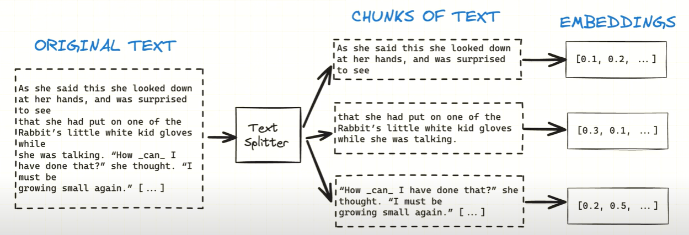
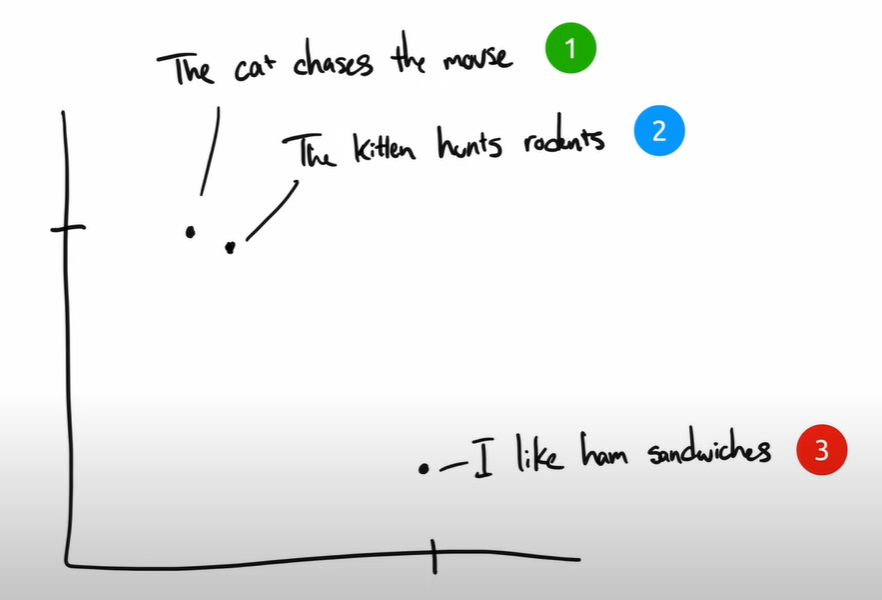
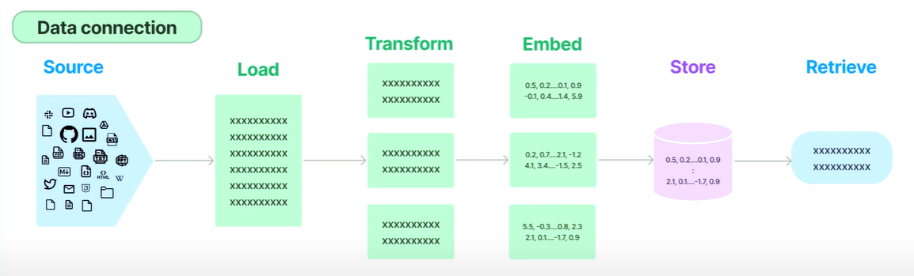
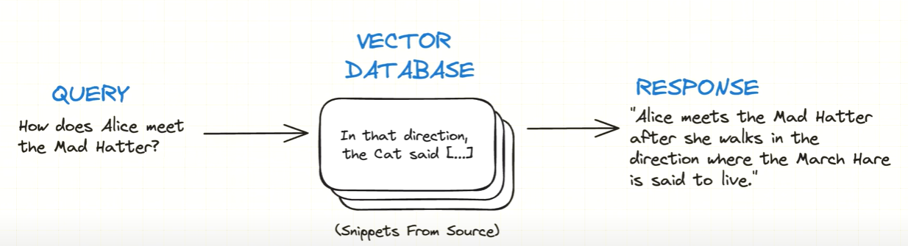

# rag_ex

## Embeddings

* load md data into document ('document_loaders')
* doc → text from the md + metadata, (as well as any other metadata can also be added)
* single doc can be v. long (problem), i.e. not enough to load each md file into 1 doc
* also split each doc, if they're too long on their own
* those smaller chunks → could be a para, sentence, or even several pages
* so that → when we search through all of this data, each chunk is gonna be more focused & more relevant to what we-re looking for ('RecursiveCharacterTextSplitter')
* to be able to query each chunk → need to turn this into a db → chromadb → as it uses vector embeddings as the key

[rabbit hole syndrome: embeddings 101](https://youtu.be/QdDoFfkVkcw?si=hY-VQVtDCF_1fcg3)

* texts with similar meaning will be plotted together on the chart, & dis-similar → far apart
* coordinates of these embeddings → those 2 number coordinates → they represent the embeddings
* (2D chart here for example)
* in reality we use way more than 2 dimensions (in 100s or 1000s)

## Vector Embeddings

* [OpenAI Tokenizer](https://platform.openai.com/tokenizer)
* [Algo. used by OpenAI: **Byte-Pair Encoding (BPE)** or **Diagram Coding** → which uses lookup table for the mapping](https://huggingface.co/learn/llm-course/en/chapter6/5)
* [Tokenization Algo. used for BERT (by google): **WordPiece Encoding**](https://huggingface.co/learn/llm-course/en/chapter6/6?fw=pt)

[MTEB: massive text embedding benchmark](https://huggingface.co/papers/2210.07316)

## Query for Relevant data

* Objective → to find the chunks in the db, that'll most likely contain the answer to the question that we wanna ask
* How → using the db created earlier, and the same embedding function (that was used to create that db)

* Goal → 
  * take a query
  * turn that into an embedding (using the same func.)
  * & then scan through the db, & find maybe 5 chunks of info. that are closest in embedding distance from our query
  * those chunks are then used to craft a more custom response, that's still based on our source info.

## Create Response
* calling an LLM to generate the response based on the context

## Other References:
* [pixegami: video project ref.](https://www.youtube.com/watch?v=tcqEUSNCn8I)
* [pixegami: repo](https://github.com/pixegami/langchain-rag-tutorial/tree/main)
* [aws lambda dev guide](https://github.com/awsdocs/aws-lambda-developer-guide)
* [rabbit hole syndrome: repo](https://github.com/rabbit-hole-syndrome/open-source-embeddings)
* [ai jason: HF + LC](https://youtu.be/_j7JEDWuqLE?si=nfy7bb52VfbkMdQL)
* [SBERT](https://sbert.net/)
* [LangChain](https://python.langchain.com/docs/tutorials/retrievers/)
* [ChromaDB](https://docs.trychroma.com/docs/overview/getting-started)